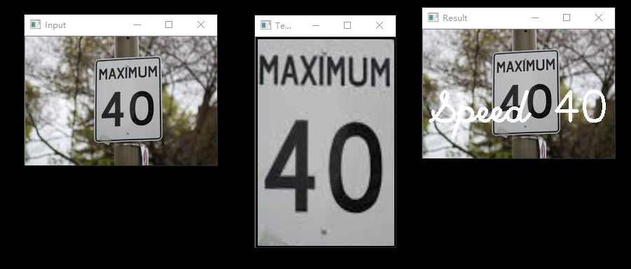
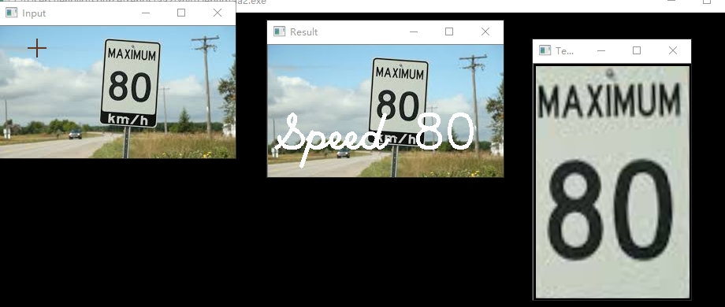
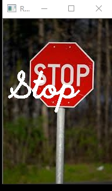

# Image-Recognition-Street-Sign

# Description
Input a image for recognition, and a template image for matching, the result will be shown on the input image with a text indicate the recognition.
Using OpenCV to recognize different street sign, based on Canny Algorithm and Image Matching.

# Demo Screenshot

